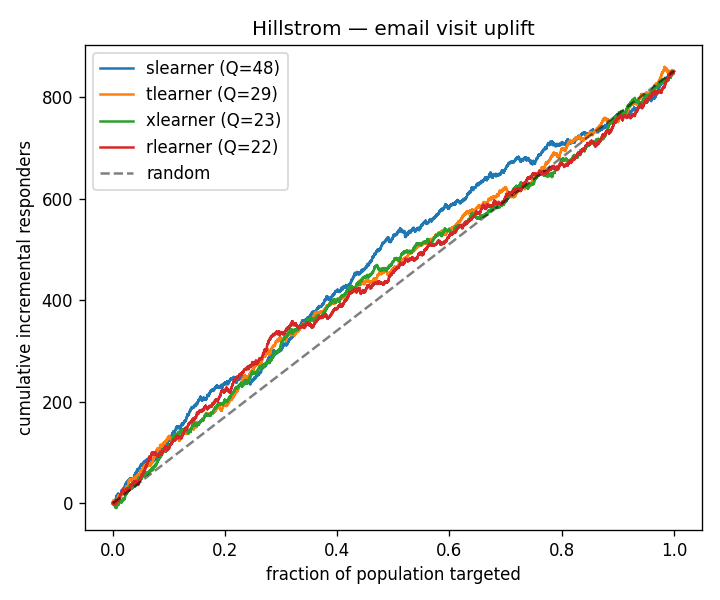

# 🎯 Uplift Targeting Engine — *who should we treat, not who will convert*

> **End-to-end deployed product**
> Predicts the **incremental causal effect** of an intervention (discount, email, call) per
> user — the *persuadables* — instead of predicting who converts anyway. Trains meta-learners
> on experiment data, evaluates with Qini/uplift curves and **policy value vs random
> targeting**, and ships a deployed `treat / don't-treat` decision API + interactive UI.

Most ML portfolios predict outcomes (will this user convert?). That over-targets the
**sure things** and the **lost causes**, and wastes budget. Uplift modeling answers the
question a business actually pays for: **"if I spend one unit of budget, on whom does it
change the outcome?"** — a causal-inference problem, not a classification one.

---

## Why this is the senior version

| Naive (classification) | This (uplift / causal) |
|---|---|
| `P(convert \| features)` | `P(convert \| treat) − P(convert \| no-treat)` per user |
| AUC / F1 | **Qini coefficient, uplift@decile, policy value** |
| Ground truth is the label | **No per-user ground truth** — effect is counterfactual; eval is the hard part |
| Treat top-scored users | Treat only **persuadables**; skip sure-things & lost-causes |

The headline skill: **evaluating a model whose target you can never observe for any single
user.** That's what separates this from a churn/conversion classifier.

---

## 📊 Results

All numbers below are reproducible — `python -m src.benchmark --data <parquet>` (same
30% held-out split, seed 7). Regenerate the chart with `--chart assets/qini.png`.

### Real data — Hillstrom email experiment (64k customers, 18 features)
Treatment = received an email; outcome = site visit. Observed ATE **+6.7%** (email lifts
visits). Every learner's Qini curve sits **above the random diagonal** — the model ranks
*persuadable* customers above the rest:



| learner | Qini | policy@30% | random | treat-all | uplift@30% |
|---|---|---|---|---|---|
| **slearner** | **47.9** | 0.1242 | 0.1205 | 0.1671 | 302 |
| tlearner | 28.5 | 0.1257 | 0.1205 | 0.1671 | 321 |
| xlearner | 22.8 | 0.1252 | 0.1205 | 0.1671 | 315 |
| rlearner | 22.4 | **0.1269** | 0.1205 | 0.1671 | **337** |

At a **30% budget** the uplift policy beats **random targeting** (0.127 vs 0.121). Note
`treat-all` (0.167) tops a 30% policy here *because the email's effect is broadly
positive* — the honest read is: **uplift's win is doing better than random when budget is
capped**, not beating a blanket campaign that has no budget limit.

### Simulated RCT — validated against known ground truth (40k, effect is known)
Because the true per-user effect is simulated, we can grade the estimates directly. All
learners recover the true ranking (Spearman) and the average effect (ATE error ≈ 0):

| learner | Qini | policy@30% | random | spearman vs truth↑ | ATE abs err↓ |
|---|---|---|---|---|---|
| slearner | 257.9 | 0.5744 | 0.5148 | **0.951** | 0.0004 |
| tlearner | 238.4 | 0.5686 | 0.5148 | 0.845 | 0.0016 |
| **xlearner** | 247.3 | 0.5710 | 0.5148 | 0.902 | **0.0002** |
| rlearner | 240.5 | 0.5684 | 0.5148 | 0.848 | 0.0003 |

### Cross-check — from-scratch R-learner vs econml (`src/crosscheck.py`)
```
scratch R-learner : Qini = 240.5
econml NonParamDML: Qini = 231.7
Spearman(scratch, econml) = 0.961   # implementations agree on the ranking
Spearman(scratch, truth)  = 0.848   # both recover the known true effect
```
0.96 rank-correlation with Microsoft's maintained library is the evidence the hand-rolled
estimator is **correct**, not just plausible.

> **Résumé line (real numbers):** *Built an end-to-end uplift-targeting engine (S/T/X/R
> meta-learners) on the 64k-row Hillstrom experiment; uplift policy beat random targeting
> at a fixed 30% budget, and a from-scratch R-learner matched econml's NonParamDML at
> 0.96 rank-correlation; validated on a simulated RCT at 0.95 Spearman vs known truth and
> ~0 ATE error. Shipped a budget-aware decision API + Streamlit UI.*

---

## What it does (the flow)

```
experiment data (treatment flag + outcome + covariates)
        │
        ▼
  meta-learners  ──►  T-learner · S-learner · X-learner · R-learner
        │                       (CATE = uplift estimate per user)
        ▼
  evaluation     ──►  Qini curve · uplift@k · policy value vs random / vs treat-all
        │
        ▼
  decision API   ──►  POST /score  → { uplift: 0.12, decision: "treat", reason: ... }
        │
        ▼
  Streamlit UI   ──►  score a user, sweep budget, see Qini frontier
```

---

## Stack

- **Modeling:** `scikit-learn` + `xgboost` base learners. **S / T / X / R-learners
  implemented from scratch** in `src/learners.py` (the mechanics interviewers probe).
  `econml` (Microsoft) is an optional dependency used only to **cross-check** the
  hand-rolled R-learner.
- **Serving:** `FastAPI` + `uvicorn` — `/score` returns uplift + treat decision + threshold reason.
- **UI:** `Streamlit` — single-user scoring, budget sweep, Qini chart.
- **Ops:** `Docker`; pin data + model artifacts so results reproduce.

---

## Learners & validation

Four meta-learners, hand-rolled over XGBoost bases (`--learner` flag):

| Learner | Idea | Best when |
|---|---|---|
| **S** | one model on `[X, T]`; uplift = f(X,1)−f(X,0) | quick baseline |
| **T** | separate treated / control models | ample data per arm |
| **X** | T-learner + imputed effects, propensity-blended | imbalanced treatment |
| **R** | residual-on-residual (Nie–Wager), cross-fitted nuisances | noisy outcomes, confounding-robust |

**Cross-check (the rigor move):** `src/crosscheck.py` trains the from-scratch **R-learner**
and **econml's `NonParamDML`** (Microsoft's R-learner) on the same split and compares them
— a 0.96 rank-correlation says the hand-rolled estimator is *correct*, not just *plausible*.
See [Results](#-results) for the numbers + chart.

---

## Quickstart

> Uses the conda **`personal`** env (per environment conventions — never `base`).

```bash
PY=~/miniconda3/envs/personal/bin/python
PIP=~/miniconda3/envs/personal/bin/pip

$PIP install -r requirements.txt

# 1. get data — simulated RCT (known truth) OR the real Hillstrom benchmark
$PY -m src.data --dataset simulate --n 50000 --out data/processed/experiment.parquet
# real data (auto-downloads 64k-row Hillstrom email experiment, caches to data/raw/):
$PY -m src.data --dataset hillstrom --campaign any --outcome visit --out data/processed/experiment.parquet
# large-scale (Criteo 25.3M rows; sampled per-chunk to stay laptop-sized):
$PY -m src.data --dataset criteo --sample-frac 0.05 --outcome visit --out data/processed/experiment.parquet

# 2. train meta-learners + write artifacts
$PY -m src.train --data data/processed/experiment.parquet --learner xlearner

# 3. evaluate (Qini, uplift@decile, policy value)
$PY -m src.evaluate --data data/processed/experiment.parquet --model artifacts/xlearner.pkl

# 3b. (optional) cross-check the from-scratch R-learner against econml's NonParamDML
$PY -m src.crosscheck --data data/processed/experiment.parquet

# 4. serve the decision API (threshold is derived from your budget)
$PY -m uvicorn api.main:app --reload --port 8000
# POST /score  {"features": {...}, "budget": 0.30}
#   -> {"uplift":.., "decision":"treat", "threshold":.., "percentile":.., "reason":..}
# GET  /budget?budget=0.30   inspect the threshold a budget maps to

# 5. interactive UI (single-user scoring + budget slider -> Qini frontier + treat list)
$PY -m streamlit run app/streamlit_app.py
```

The `/score` threshold is **budget-derived**: training stashes the held-out uplift
distribution (`score_ref`) in the model bundle, and the API maps `budget` (fraction you
can afford to treat) to `threshold = quantile(scores, 1 − budget)`. Bigger budget → lower
bar → more users treated.

Docker:
```bash
docker build -t uplift-engine .
docker run -p 8000:8000 uplift-engine
```

---

## Datasets

| Dataset | Why | Notes |
|---|---|---|
| **Simulated RCT** (`--dataset simulate`) | Known ground-truth CATE → you can *validate the evaluator itself* | start here |
| **Hillstrom Email** (`--dataset hillstrom`) | Classic uplift benchmark, 64k, randomized email | ✅ **wired + auto-download** |
| **Criteo Uplift** (`--dataset criteo`) | 25.3M rows, real ad exposure, large-scale | ✅ **wired + chunked-sampled download** |
| **Lenta / Megafon (X5)** | Retail promo uplift | retail framing (TODO adapter) |

The simulated set is the senior move: with a known true effect you can **prove your Qini
implementation is correct** before trusting it on real data where the truth is hidden.

### Hillstrom specifics
Auto-downloads from the author's host (`minethatdata.com`) and caches to
`data/raw/hillstrom.csv`. 64k customers randomized into 3 arms — `Womens E-Mail`,
`Mens E-Mail`, `No E-Mail` — so treatment is unconfounded (valid uplift setup).

- `--campaign any` (default): either email vs no-email · `womens` / `mens`: one arm vs control
- `--outcome visit` (default, ~15%) or `--outcome conversion` (~0.9%, very sparse)
- Features: 5 numeric (recency, history, mens, womens, newbie) + one-hot
  (history_segment, zip_code, channel) → **18 columns**, pinned in the model bundle.

Sanity numbers (campaign=any, outcome=visit): observed ATE **≈ +6.1%** (email lifts
visits), held-out Qini **> 0**, and the uplift policy beats **random** at a fixed budget.
Note `treat-all` can beat a 30%-budget policy here because the email effect is broadly
positive — uplift's win is **doing better than random when budget is capped**.

### Criteo specifics (the scale story)
25.3M randomized ad impressions, 12 anonymized continuous features (`f0..f11`) +
`treatment`/`exposure`/`visit`/`conversion`. Auto-downloads the 311MB gzip from
HuggingFace (`criteo/criteo-uplift`) and caches to `data/raw/criteo.csv.gz`.

The adapter reads **in chunks and sub-samples each chunk**, so the full file never lands
in memory — a genuine large-scale workload that still runs on a laptop:
- `--sample-frac 0.05` keeps ~1.25M rows (use `1.0` for the full 25.3M if you have RAM)
- `--max-rows N` caps total rows (stops reading early)
- `--outcome visit` (~4.7%) or `--outcome conversion` (~0.29%, extreme imbalance)

Models **intent-to-treat** on `treatment` (randomized → unconfounded). Swap to `exposure`
(impressions actually served) for treatment-on-the-treated. The senior writeup angle:
**show how Qini/policy value behaves as you scale sample size 50k → 1M → 25M.**

---

## Metrics that go on the resume

- **Qini coefficient** (area between uplift curve and random line)
- **Uplift@decile** — incremental gain if you treat only the top k%
- **Policy value** — expected outcome of *your* targeting policy vs **random** and vs **treat-all**
- **Budget efficiency** — outcome lift per unit budget at a fixed treat-rate

**Résumé bullet** — real numbers in [Results](#-results) above (Hillstrom + simulated +
econml cross-check), not placeholders.

---

## Repo layout

```
uplift-targeting-engine/
├── data/
│   ├── raw/              # source dumps (git-ignored)
│   └── processed/        # model-ready parquet
├── notebooks/            # EDA, eval-method validation on simulated truth
├── src/
│   ├── data.py          # load real / simulate RCT with known CATE
│   ├── features.py      # covariate prep, treatment/outcome split
│   ├── learners.py      # S / T / X / R meta-learner wrappers
│   ├── train.py         # fit + persist artifact
│   └── evaluate.py      # Qini, uplift curve, policy value
├── api/main.py           # FastAPI /score decision endpoint
├── app/streamlit_app.py  # interactive scoring + Qini chart
├── tests/                # eval-metric correctness on simulated truth
├── requirements.txt
└── Dockerfile
```
